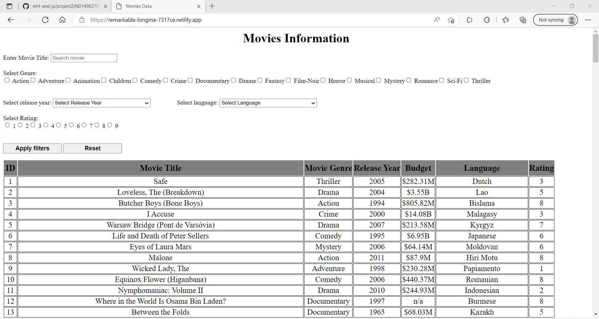
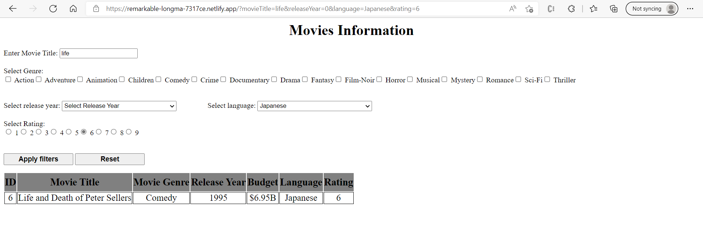
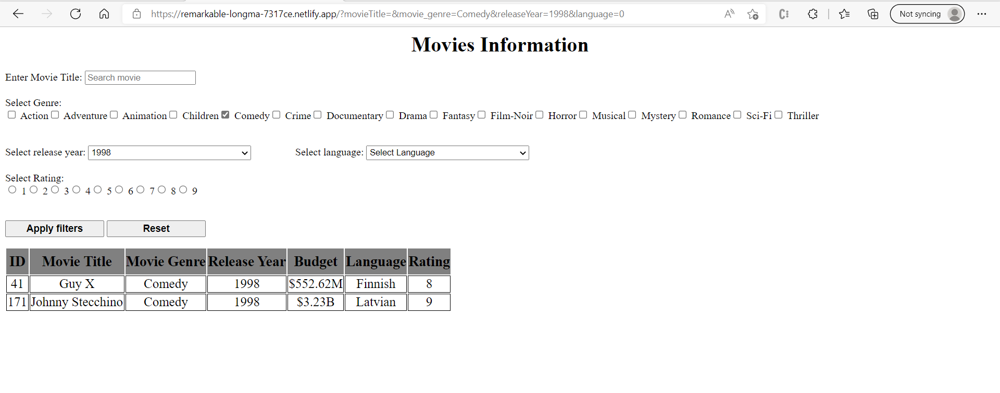

DATA : Designed the movies.json file
- The json file contains the general information of 250 movies .
- It has movie id, movie title, movie genre,release year, rating, budget and language fields for each movie.

API : Created the API controller 
- The movies.js file contains the API controller along with getAll and gettById functions.

VIEW:

Created the HTML table 
- The html table  has a column for every field of the movie item present in the json file.
- It contains the table header,table body, submit & reset buttons and filter inputs
- index.html file also contains css features for the table contents and web page formatting.

Created the filter form
- Filtering feature is developed for every column of the html table.The movie title is filtered using text input.
- Multiple movie genres can be selected at the same  time using the checkbox .
- The release year and language of the movie can be selected using dropdowns .
- The movie rating can be selected using the radiobuttons.These are rendered using javascript implemented in the bundle.js file.
- After selecting the options using text input,radiobutton,dropdown or checkbox when we click on "Apply filters" it  reads the url parameters which will contain the inputs provided and filter the table data.
- When we click the Reset button the form reloads and all our previous selections are lost.

DEPLOYMENT:
- The project is deployed to netlify (link)  -  https://remarkable-longma-7317ce.netlify.app

OUTPUT:

Output without any filter

- 1. Ouptut without filter

- 2. Ouptut with movie title,language and rating filter

- 3. Ouptut with year and genre filter

